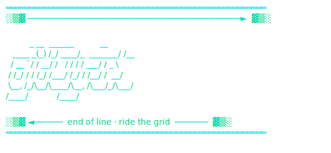
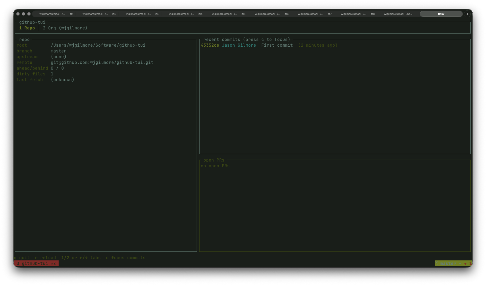
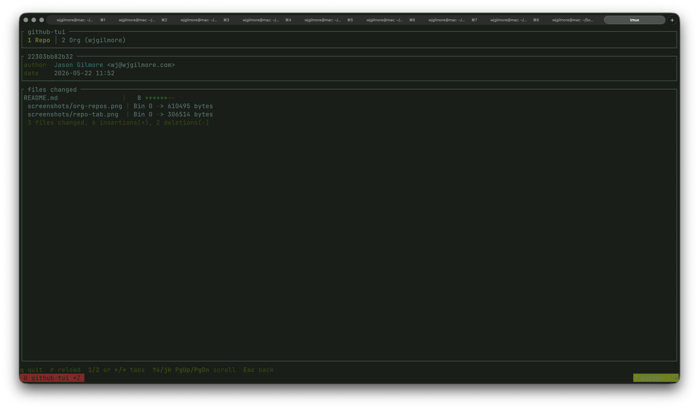
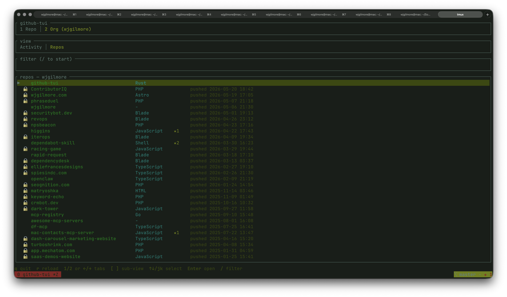

<div align="center">
  
</div>

# gitCycle

A terminal UI for exploring the git repository you're standing in and the GitHub organization it belongs to. Built with [Ratatui](https://ratatui.rs/), shells out to `git` and `gh` for data.

> The CLI binary installed by this project is named `github-tui` (defined in `Cargo.toml`). All commands below refer to that binary.



## Features

**Repo tab** — current repository overview
- Branch, upstream, ahead/behind, dirty file count, last fetch
- Recent commits (focus with `c`, press `Enter` for a full commit detail: author, message, file-by-file stats)
- Open pull requests

Pressing `Enter` on a focused commit opens a detail screen showing the commit metadata, full message, and per-file change stats:



**Org tab** — organization-wide views (org auto-detected from `origin` remote)
- **Activity** sub-view: recent PRs and issues grouped by author
- **Repos** sub-view: searchable list of all non-archived org repos, sorted by most recently pushed. Press `Enter` on a repo to drill in and see top contributors, recent commits, and recent PRs for that specific repo.



Org data is prefetched in the background on startup, so switching tabs is instant.

## Prerequisites

You need three things on your machine:

1. **Rust toolchain** — install via [rustup](https://rustup.rs/):
   ```sh
   curl --proto '=https' --tlsv1.2 -sSf https://sh.rustup.rs | sh
   ```

2. **GitHub CLI (`gh`)** — install via Homebrew (macOS), `apt`, or follow [cli.github.com](https://cli.github.com/):
   ```sh
   brew install gh
   ```

3. **Authenticated `gh`** — log in once:
   ```sh
   gh auth login
   ```
   You can be logged into multiple accounts and switch with `gh auth switch`. Make sure the active account has access to the repositories/orgs you want to view.

## Installation

From the repository root:

```sh
cargo install --path .
```

This builds in release mode and installs the binary to `~/.cargo/bin/github-tui`.

If `~/.cargo/bin` isn't on your `PATH`, add it to your shell config:

```sh
# bash / zsh
export PATH="$HOME/.cargo/bin:$PATH"
```

Then open a new terminal (or `source` your config) and verify the binary is on your PATH:

```sh
which github-tui
```

## Usage

`cd` into any git repository whose `origin` remote points to GitHub, then run:

```sh
github-tui
```

### Keyboard shortcuts

**Global**
| Key | Action |
| --- | --- |
| `q` | quit |
| `r` | reload all data |
| `1` / `2` | jump to Repo / Org tab |
| `Tab`, `←`/`→` | cycle tabs |
| `Esc` | back / close detail / unfocus panel |

**Repo tab**
| Key | Action |
| --- | --- |
| `c` | focus the recent-commits panel |
| `↑`/`↓`, `j`/`k`, `PgUp`/`PgDn`, `g`/`G` | move selection within the focused panel |
| `Enter` | open commit detail |

**Org tab**
| Key | Action |
| --- | --- |
| `[` / `]` | switch sub-view (Activity ↔ Repos) |
| `↑`/`↓`, `j`/`k`, `PgUp`/`PgDn`, `g`/`G` | scroll / move selection |

**Org → Repos sub-view**
| Key | Action |
| --- | --- |
| `/` | start typing to filter the repo list |
| `Enter` (in filter mode) | confirm filter |
| `Esc` (in filter mode) | clear filter |
| `Enter` (on a repo) | open repo detail |

## Troubleshooting

- **`error: gh ... failed: HTTP 502`** — transient GitHub API hiccup. Press `r` to retry; calls already retry up to 3× internally with backoff.
- **`could not resolve to a Repository`** — the active `gh` account doesn't have access. Run `gh auth status` to check, and `gh auth switch` if you have multiple accounts.
- **Org tab shows "loading…" forever** — the background fetch failed silently. Press `r` to retry, or run the underlying command manually to see the error: `gh search prs --owner <ORG>` / `gh repo list <ORG>`.

## License

MIT — see [LICENSE.md](LICENSE.md).
